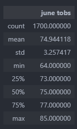
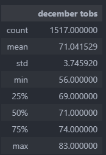

# Surfs Up Weather Analysis

## Overview of the analysis

### Objectives

The purpose of this analysis is to review a dataset pertaining to weather conditions that has been stored in a SQLite database to provide information that will convince an investor that opening up a Surf n' Shake shop in Oahu, Hawaii is a good business idea. This analysis is focusing on comparing different statistics between weather data in June and December months to choose the most suitable month, by considering the weather data to establish the profitability of a surf and ice cream shop..

### Dependencies

SQLite- Automap and Baseengine functions and SQLAlchemy 
Jupyter Notebook to import dependencies and create the commands to pull the data from the SQLite database

## Results

### The following tables summarize June month temperature statistics.

### The following tables summarize December month temperature statistics.

- Minimum temperature in June is 64 degrees and in December, it is 56 degrees. It will affect to the ice cream sales due to the cold weather.
- Maximum temperature in June is 85 degrees and 83 degrees in December. There is no big difference between those two values.
- Standard deviations between June month and December month is different and it is high in December month. It will vary the statistics values in the month December more than the June month.

## Summary

By considering the above statistical details, which are very similar in some parameters, but different in other parameters, we can say that the month June is more suitable for running the surf and ice cream shop but the sales in December won't be too slow either. So, this place is ideal for running this venture.

As additional queries, we can run a query to detect the difference between June and December in rainy weather. Also, we can run a query to do a comparison by weather station, as we may see higher or lower temperatures and precipitation levels at different locations.

